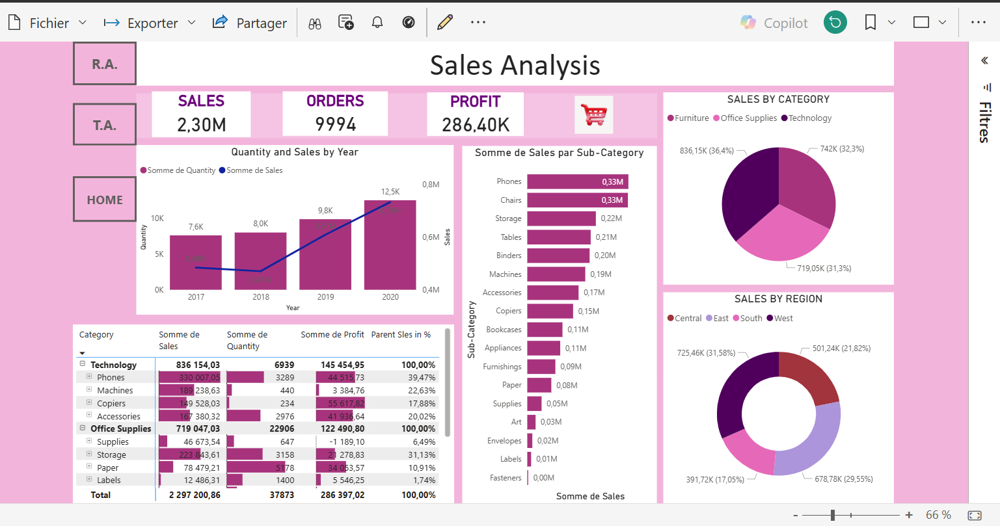
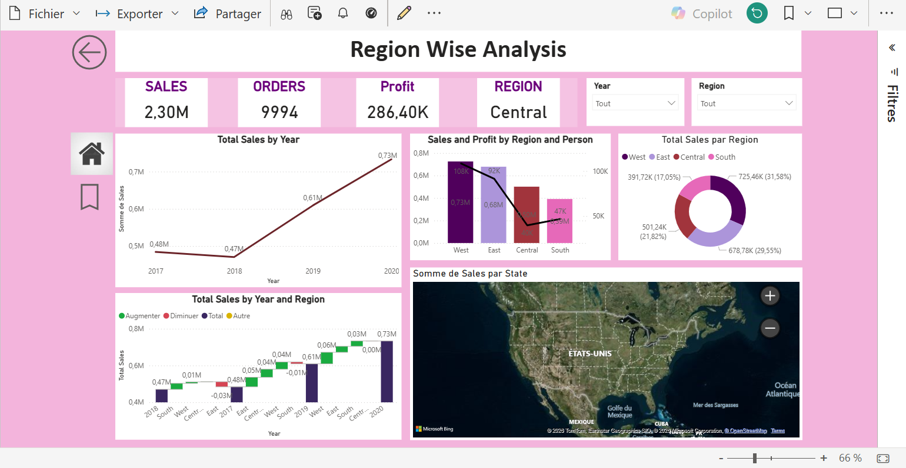
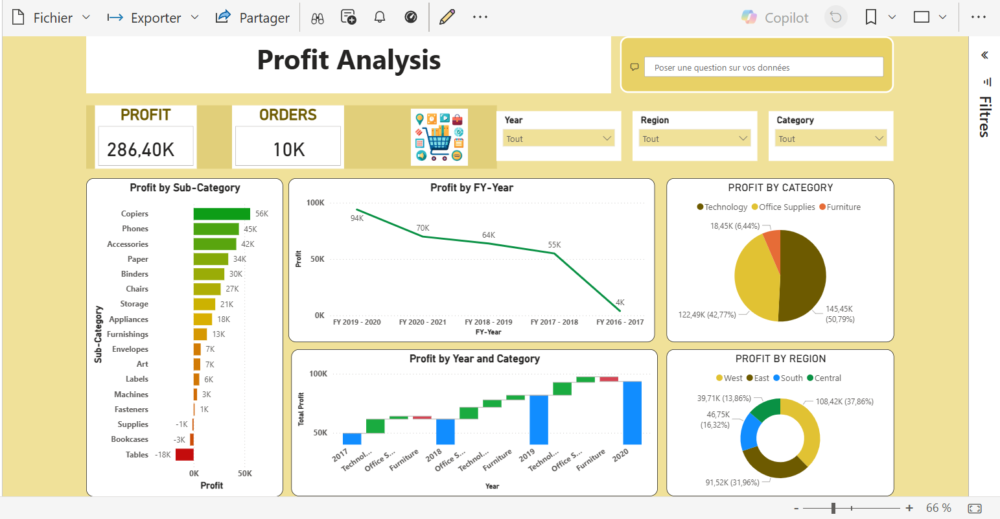

# 📊 Retail Sales Dashboard (Power BI)

## 📌 Overview
This project analyzes retail sales performance using Power BI.  
The dashboard provides insights into sales trends, performance over time, and key business metrics.

---

## 🚀 Key Features
- KPI tracking (Total Sales, Year-over-Year comparison)
- Time-based analysis (Year, Quarter)
- Interactive and user-friendly dashboard
- Data modeling with relationships

---

## 🛠 Tools Used
- Power BI
- DAX (Data Analysis Expressions)
- Data Modeling

---

## 📈 Key Insights
- Sales trends show variation across different periods
- Year-over-year comparison highlights performance changes
- KPIs provide quick business overview for decision-making

---

## 📷 Dashboard Preview

### 🔹 Full Dashboard

### 🔹 KPIs

### 🔹 Sales Trend

